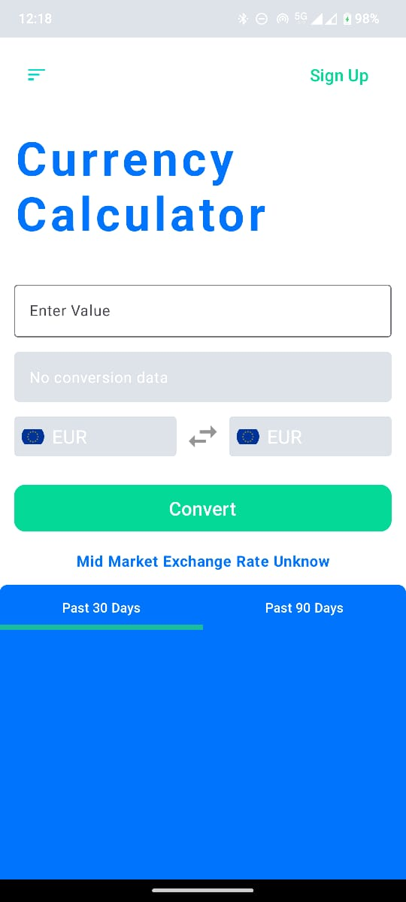

## currency-converter with Jetpack Compose

`Currency converter` app helps you to convert one currency to another currency

# Screenshot



### 🏗️ Project Structure: 

````
├── src
|    ├── composable
|    |    └── ConvertScreen.kt
|    |    └── CurrencyConvertorScreen.kt
|    |  
|    ├── data
|    |    └── local
|    |    |     ├── dao
|               |     └── RateDao.kt
|    |    |     ├── entity
|               |     └── RatesEntity.kt
|    |    |     └── AppDatabase.kt
|    |    └── remote
|    |    |     ├── model
|               |     └── RateResult
|    |    |     └── ConvertorApi
|    |    └── repository
|    |    |     ├── MainRepository
|    |    |     └── MainRepositoryImpl
|    |
|    ├── di
|    |    └── AppModule
|    |    └── DatabaseModule
|    |
|    ├── main
|    |    ├── MainRepository
|    |    └── MainViewModel
|    |
└──  ├── utils
     |    ├── ConvertEvent
     |    └── Resource
     |
     ├── MainActivity
     └── Application
````

### 🔨 This sample app showcases the following:
- Kotlin
- Clean and Simple UI with Jetpack Compose
- Coroutines
- MVVM(Model + View + ViewModel)
- ApiLayer
- Dagger Hilt for DI
- Retrofit

### Built With 🛠
- [Jetpack Compose](https://developer.android.com/jetpack/compose) - Jetpack Compose is Android’s modern toolkit for building native UI. It simplifies and accelerates UI development on Android. Quickly bring your app to life with less code, powerful tools, and intuitive Kotlin APIs.
- [Kotlin](https://kotlinlang.org/) - First class and official programming language for Android development.
- [Coroutines](https://kotlinlang.org/docs/reference/coroutines-overview.html) - For asynchronous and more.
- [Dependency Injection](https://developer.android.com/training/dependency-injection) -
    - [Hilt-Dagger](https://dagger.dev/hilt/) - Standard library to incorporate Dagger dependency injection into an Android application.
- [MVVM stands for Model, View, ViewModel](https://www.digitalocean.com/community/tutorials/android-mvvm-design-pattern) - 
   - `Model`: This holds the data of the application. It cannot directly talk to the View. Generally, it’s recommended to expose the data to the ViewModel through Observables.
   - `View`: It represents the UI of the application devoid of any Application Logic. It observes the ViewModel.
   - `ViewModel`: It acts as a link between the Model and the View. It’s responsible for transforming the data from the Model. It provides data streams to the View. It also uses hooks or callbacks to update the View. It’ll ask for the data from the Model.


## Contact

You can connect with me here [LinkedIn](https://www.linkedin.com/in/emmanueldav/)

## Project
Other fintech open source project [HERE](https://github.com/EmmanuelDav/Fintech)

